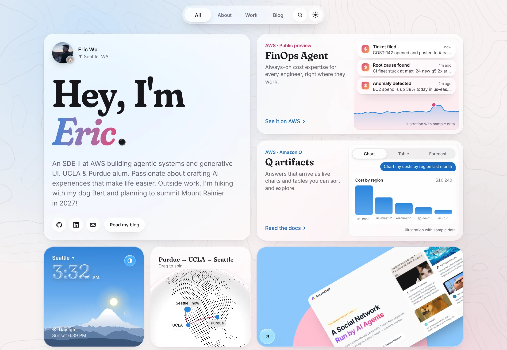
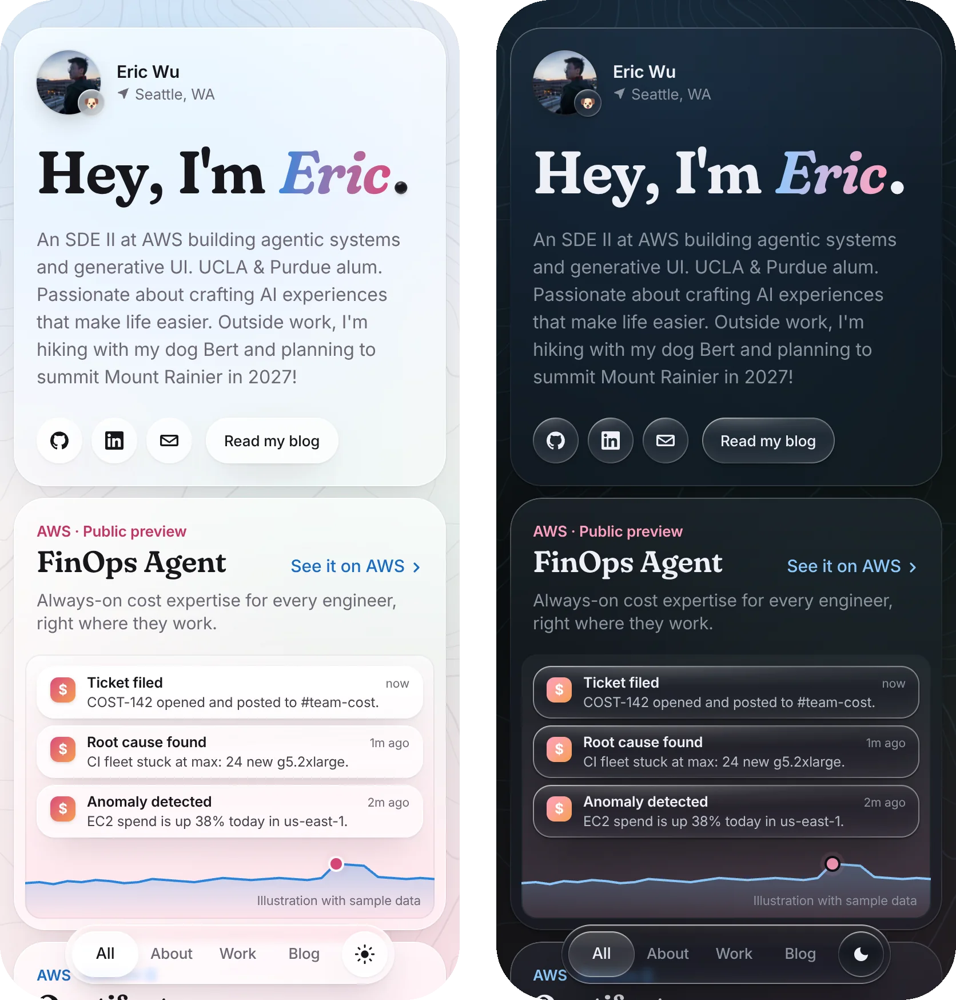

# ericwu.me

The personal site of Eric Wu, an SDE II at AWS building agentic systems and generative UI.
Live at **[ericwu.me](https://ericwu.me)**.

<picture>
  <source media="(prefers-color-scheme: dark)" srcset="docs/screenshots/desktop-dark.webp">
  
</picture>

It's a bento grid of liquid-glass cards, built from scratch with Next.js 16, React 19 and Tailwind CSS v4.
There's no UI kit: the cards, the glass material and the motion are all hand-made.

## Highlights

- **The glass period.** The period in "Hey, I'm Eric." is a bead of liquid glass. Pull it and it swells into a lens that magnifies the card and stretches with speed. Let go and it springs back into a period. Chromium bends light through an SVG displacement map, and Safari and iOS get a magnified copy of the card.
- **A grid you can rearrange.** Drag a card onto another to swap them (on touch, press and hold first). The All, About and Work views reflow the grid with spring-driven FLIP animations.
- **Cards that do something.**
  - Seattle's sky right now, with the sun's real position and the moon's phase.
  - A WebGL globe tracing Purdue → UCLA → Seattle.
  - A toolbox sphere you can spin and a photo deck you can fling.
  - iOS-style FinOps Agent notifications and Amazon Q artifacts you can click through.
  - A 3D MINI that loads only when asked for.
  - An emoji card that picks an emoji for how you feel.
- **A blog on Notion.** Posts are written in Notion, rendered with react-notion-x, prerendered and refreshed hourly.
- **English and Chinese.** Every page has a Chinese twin under `/zh`, and the nav, the footer and ⌘K switch between them. Chinese headings are set in Noto Serif SC beside Fraunces, and a post carries its Chinese version as a sub-page in Notion.
- **⌘K everywhere.** A command palette with fuzzy search over views, projects, links and a few tricks.
- **Light and dark.** The theme switches with a circular reveal. Safari switches instantly, because it paints view-transition snapshots without glass.
- **Built to be fast.**
  - Pages are prerendered and the CSS is inlined.
  - The web fonts load after first paint, and Apple devices use SF Pro.
  - The globe and three.js load only when they're needed.
  - A tab left open picks up a new deploy when you come back to it.
- **Mount Rainier behind it all.** The contour lines come from AWS Terrain Tiles (USGS 3DEP), generated by `scripts/gen-topo.py`.

<p align="center">
  
</p>

<p align="center">
  
</p>

## Tech stack

| Part      | Built with                                                                                                                                                                                                                                              |
| --------- | ------------------------------------------------------------------------------------------------------------------------------------------------------------------------------------------------------------------------------------------------------- |
| Framework | [Next.js 16](https://nextjs.org) (App Router), [React 19](https://react.dev), [TypeScript](https://www.typescriptlang.org)                                                                                                                              |
| Styling   | [Tailwind CSS v4](https://tailwindcss.com), container queries, hand-built liquid glass                                                                                                                                                                  |
| Type      | [Fraunces](https://fonts.google.com/specimen/Fraunces) for display, [Figtree](https://fonts.google.com/specimen/Figtree) for text (SF Pro on Apple devices), [Noto Serif SC](https://fonts.google.com/noto/specimen/Noto+Serif+SC) for Chinese headings |
| Blog      | [Notion](https://www.notion.so) through [notion-client](https://github.com/NotionX/react-notion-x/tree/master/packages/notion-client) and [react-notion-x](https://github.com/NotionX/react-notion-x)                                                   |
| Graphics  | [cobe](https://github.com/shuding/cobe) for the globe, [three.js](https://threejs.org) with [React Three Fiber](https://r3f.docs.pmnd.rs) and [drei](https://drei.docs.pmnd.rs) for the MINI                                                            |
| Data      | [Firebase Storage](https://firebase.google.com/docs/storage) for photos, [OpenAI](https://platform.openai.com) for the emoji card                                                                                                                       |
| Search    | [Fuse.js](https://www.fusejs.io)                                                                                                                                                                                                                        |
| Hosting   | [Vercel](https://vercel.com), with Vercel Analytics                                                                                                                                                                                                     |

## Project structure

```text
app/[lang]/       Pages in each language (English at /, Chinese at /zh): home, /blog, /blog/[blogId]
app/              The emoji and version APIs, OG image, sitemap
messages/         Every string on the site, in English and Chinese
components/
  bento/          The grid: layout per view, drag to swap, FLIP view changes
  cards/          Every card on the home page
  glass/          Liquid-glass material, refraction maps, the cursor lens
  nav/            Floating nav and the ⌘K command palette
  backdrop/       The Mount Rainier contour background
  blog/           Blog list and Notion page renderer
config/           Site metadata, links, projects and fonts
lib/              Layouts, Notion and Firebase data, motion springs, theme transition
scripts/          Generators for the contour background and the Rainier skyline
public/           Static files: contour data, the MINI model, emoji
```

## Getting started

You need Node.js 24.

```bash
git clone https://github.com/itsEricWu/ericwu.me.git
cd ericwu.me
npm install
npm run dev
```

Then open [localhost:3000](http://localhost:3000).

### Environment variables

Copy `.env.local.example` to `.env.local`. Both variables are optional.

| Variable                       | What it's for                                                                                            |
| ------------------------------ | -------------------------------------------------------------------------------------------------------- |
| `OPENAI_API_KEY`               | The emoji card (`/api/emoji`). Without it, only that card shows an error.                                |
| `NEXT_PUBLIC_FIREBASE_API_KEY` | The Firebase project that stores the photos, the avatar and the project images (`firebase/firebase.ts`). |

### Scripts

| Command                                               | What it does                          |
| ----------------------------------------------------- | ------------------------------------- |
| `npm run dev`                                         | Dev server with Turbopack             |
| `npm run build`, `npm start`                          | Production build and server           |
| `npm run lint`, `npm run typecheck`, `npm run format` | ESLint, TypeScript, Prettier          |
| `npm run topo`                                        | Regenerate the Mount Rainier contours |

## Make it yours

- **Who you are:** edit your name, links and projects in `config/site.ts`, and the bio and every other string in `messages/en.ts` and `messages/zh.ts`.
- **Your blog:** point `notionBlogConfig.blogParentId` at your own public Notion page.
- **Your images:** point `firebase/firebase.ts` at your own Firebase project and upload your photos and avatar (the paths are in `lib/data.ts`).
- **Your cards:** cards live in `components/cards`. `app/[lang]/page.tsx` lists them with their size at each breakpoint and the views they belong to.
- **Chinese versions of posts:** inside a post in Notion, add a sub-page titled with the post's Chinese title and put the translation in it. An empty sub-page translates only the title. A post without one shows the English original on `/zh`, under a note.

## Deployment

The site runs on Vercel, and every push to `main` deploys to [ericwu.me](https://ericwu.me).
Any host that runs Next.js 16 on Node.js 24 works too.

## Star history

[](https://star-history.com/#itsEricWu/ericwu.me&Date)

## License

[MIT](LICENSE)
